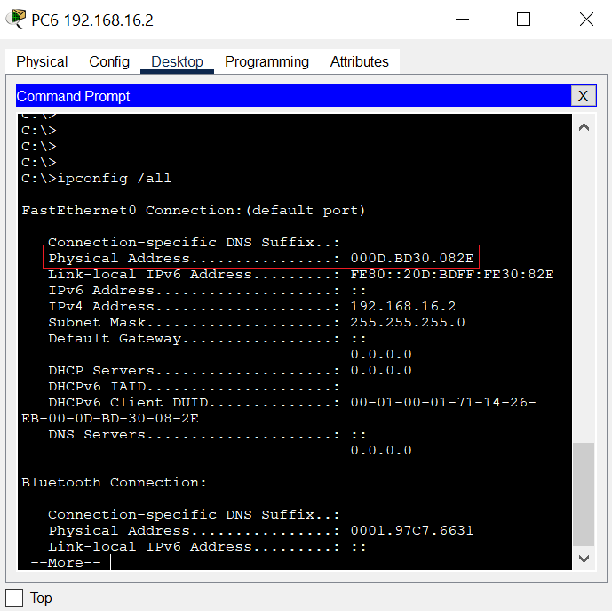
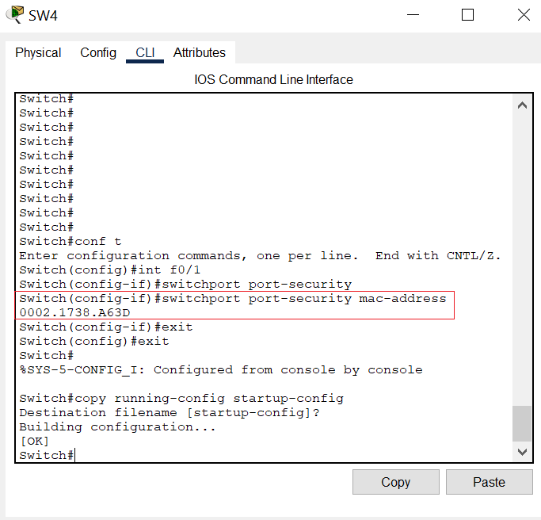
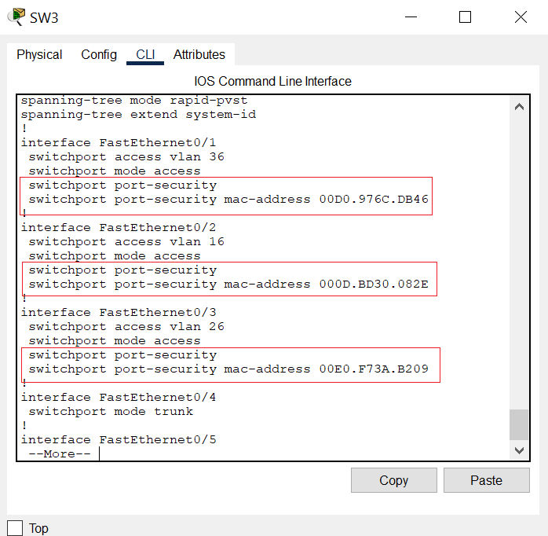
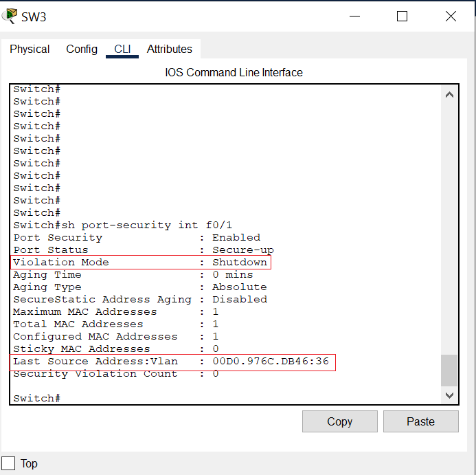

# **Grupo #6 | Practica1**
- Universidad de San Carlos de Guatemala
- Facultad de Ingeniería
- Escuela de Ciencias y Sistemas
- Auxiliar: Adriana López
##### REDES DE COMPUTADORAS 2 Sección N

## **Integrantes**
| Carnet    | Nombre |
| ------    | ------ |
| **201115018** | **Joel Rodríguez Santos** |
| 201700644 | Javier Roberto Alfaro Vividor |
| 201709311 | Edin Emanuel Montenegro Vasquez |
| 200915080 | Julio Roberto Vasquez Santiago  |

        
---
### **Configuracion de PC'S**
Se tienen 9 PC's las cuales se les asigno una IP y su mascara de red, las cuales se encuentran en la siguiente tabla:

| PC | IP | Mascara | NO. VLAN | NOMBRE VLAN |
| ------ | ------ | ------ | ------ | ------ |
| PC1 | 192.168.16.1 | 255.255.255.0 | 16 | Primaria16 |
| PC2 | 192.168.16.3 | 255.255.255.0 | 16 | Primaria16 |
| PC6 | 192.168.16.2 | 255.255.255.0 | 16 | Primaria16 |
| ------ | ------ | ------ | ------ | ------ |
| PC7 | 192.168.26.1 | 255.255.255.0 | 26 | Basicos26 |
| PC8 | 192.168.26.2 | 255.255.255.0 | 26 | Basicos26 |
| PC9 | 192.168.26.3 | 255.255.255.0 | 26 | Basicos26 |
| ------ | ------ | ------ | ------ | ------ |
| PC3 | 192.168.36.1 | 255.255.255.0 | 36 | Diversificado36 |
| PC4 | 192.168.36.2 | 255.255.255.0 | 36 | Diversificado36 |
| PC5 | 192.168.36.3 | 255.255.255.0 | 36 | Diversificado36 |

***VTP Vlan Trunk Protocol***
Para conseguir conectividad entre VLAN a través de un enlace troncal entre  switches, las VLAN deben estar configuradas en cada switch. Vlan trunking protocol (VTP) proporciona un medio sencillo de mantener una configuración de VLAN coherente a través de toda la red conmutada.  

Modos de VTP: Un switch puede ser configurado de tres modos diferentes: 

  1)Server: Es el modo por defecto. Desde él se pueden crear, eliminar o modificar VLANs. Su cometido es anunciar su configuración al resto de switches del mismo dominio VTP y sincronizar dicha configuración con la de otros servidores, basándose en los mensajes VTP recibidos a través de sus enlaces trunk. Los cambios realizados en un switch en modo servidor se anuncian a todo el dominio VTP.
  
  2)Cliente: En este modo no se pueden crear, eliminar o modificar VLANs, tan sólo sincronizar esta información basándose en los mensajes VTP recibidos de servidores en el propio dominio. Un cliente VTP sólo guarda la información de la VLAN para el dominio completo mientras el switch está activado. Un reinicio del switch borra la información de la VLAN.
 
  3)Transparente: Desde este modo tampoco se pueden crear, eliminar o modificar VLANs que afecten a los demás switches. La información VLAN en los switches que trabajen en este modo sólo se puede modificar localmente. Su nombre se debe a que no procesa las actualizaciones VTP recibidas, tan sólo las reenvía a los switches del mismo dominio.

***VLAN***
Es un segmento lógico más pequeño dentro de una gran red física cableada. Es un método que permite crear redes que son independientes, aunque están dentro de una misma red física. Un usuario puede disponer de varias redes VLANs dentro de un mismo router.

***Modo Trunk***
Un enlace troncal es un enlace punto a punto, entre dos dispositivos de red, que transporta más de una VLAN (swith a awitch).

***Modo Access***
Un puerto de acceso (switchport mode access) pertenece únicamente a una VLAN asignada de forma estática (VLAN nativa). La configuración predeterminada suele ser que todos los puertos sean de acceso de la VLAN1. En cambio, un puerto trunk (switchport mode trunk) puede ser miembro de múltiples VLAN (switch a dispositivo final).

***Spanning Tree Protocol***

Como primer paso usamos el comando sh spanning-tree en los switches para poder ver la informacion relacionada a Spanning-tree como en la siguiente imagen:

Con esto podemos identificar cuales puertos estan bloqueados (BLK) y lo mas importante cual es el **root bridge**.

Para realizar la prueba de R-PVST versus PVST se tuvo que realizar lo siguiente:

  1)Identificar root bridge
  
  2)Identificar puertos BLK
  
  3)Hacer un ping extendido (ping 50 192.168.x.x -n 50): Para este caso se eligio el equipo encerrado en el circulo 1 hacia el equipo del circulo 2.

En el cuadro A, se identifica el ping que se realizo, en el recuadro B el posicionamiento en el puerto activo y el comando que se uso para deshabilitarlo "shutdown".

  4)Cuando se este ejecutando el ping extendido "apagar el puerto principal" por donde pasa el ping para asi forzar el cambio de ruta, dado a que STP fue diseñado para la redundancia de rutas.

Como se puede observar con pvst. se recupero a los 8 paquetes, un aproximado a 32s.

5)Ahora repetimos el proceso con R-pvst: Ejecutamos el comando (spanning-tree mode rapid-pvst) en todos los switches para que se pase a modo r-pvst

6)Procedemos a hacer ping extendido de los dos mismos equipos que se usaron para pvst solo que ahora para la prueba de convergencia de r-pvst

El resultado de convergencia de r-pvst fue el siguiente:

Como se puede observar la convergencia fue de 1.5-2s.

**Conclusion**
Como se puede apreciar r-pvst es superior a pvst, por lo que se dejo esta confiruacion en toda la topologia.

---
***Security-Port***
Para poder configurar la seguridad de los puertos primero se debe averiguar las mac address que seran permitidas en cada SW. Para ello se accede a las computadoras y con el comando ipconfig se puede visualizar la mac-address.

#### Direcciones
|Mac-Address|SW|Port|
|---|---|---|
|00E0.F92B.C930|SW1|f0/1|
|0001.964B.3555|SW2|f0/1|
|0060.47AA.A447|SW2|f0/2|
|00D0.976C.DB46|SW3|f0/1|
|000D.BD30.082E|SW3|f0/1|
|00E0.F73A.B209|SW3|f0/3|
|0002.1738.A63D|SW4|f0/1|
|0001.C905.530A|SW5|f0/1|
|00E0.F749.D01A|SW5|f0/2|

Con la mac-address se ingresa al switch a la cual este conectada la computadora y se procede a agregar la dirección a la lista de permitidas por el protocolo.

Para verificar que la configuración este correcta se puede utilizar el comando sh run y verifar que las configuraciones esten guardadas o el comando sh port-security int #INTERFACE

---

        
        
        
