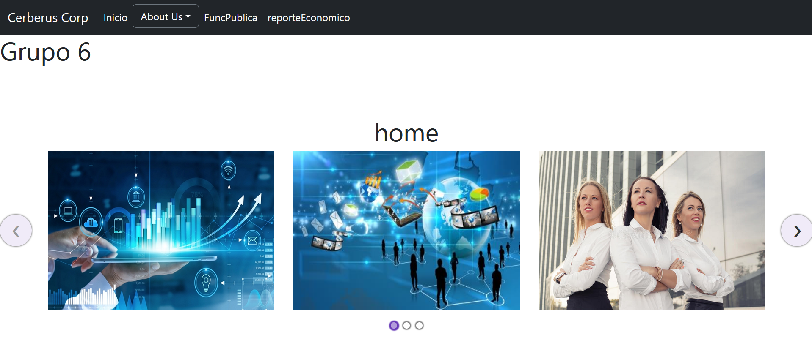

# **Grupo #6 | Proyecto 2**
- Universidad de San Carlos de Guatemala
- Facultad de Ingeniería
- Escuela de Ciencias y Sistemas
- Auxiliar: Adriana López
##### REDES DE COMPUTADORAS 2 Sección N

## **Integrantes**
| Carnet    | Nombre |
| ------    | ------ |
| **201709311** | **Edin Emanuel Montenegro Vasquez(👮🏽 coordinador)** |
| 201700644 | Javier Roberto Alfaro Vividor |
| 201115018 | Joel Rodríguez Santos |
| 200915080 | Julio Roberto Vasquez Santiago  |

---

## Contenido

* [Arquitectura del proyecto](#arquitectura-del-proyecto)
* [Servicios utilizados](#servicios-utilizados)
* [Configuraciones de servicios ](#configuraciones-de-servicios)
    * [EC2](#ec2)
    * [Elastic Load Balancer](#elastic-load-balancer)
    * [Route 53](#route-53)
    * [Configuración de dominio](#configuración-de-dominio)
* [Vistas web](#vistas-web)

---

## Arquitectura del proyecto

---
## Servicios utilizados

**AWS EC2:** ofrece la plataforma informática más amplia y profunda, con más de 600 instancias y la elección del último procesador, almacenamiento, redes, sistema operativo y modelo de compra para ayudarlo a satisfacer mejor las necesidades de su carga de trabajo. Somos el primer proveedor importante de la nube que admite procesadores Intel, AMD y Arm, la única nube con instancias EC2 Mac bajo demanda y la única nube con redes Ethernet de 400 Gbps.

**AWS Route 53:** es un servicio web de sistema de nombres de dominio (DNS) escalable y de alta disponibilidad. Route 53 conecta las solicitudes de los usuarios con las aplicaciones de Internet que se ejecutan en AWS o en las instalaciones.

**AWS Elastic Load Balancer:** es un servicio proporcionado por Amazon en el que el tráfico entrante se distribuye de manera eficiente y automática a través de un grupo de servidores back-end de una manera que aumenta la velocidad y el rendimiento. Ayuda a mejorar la escalabilidad de su aplicación y asegura sus aplicaciones.

**Get.tech:** Proveedor de dominios .tech.

---

## Configuración de servicios 

---
### EC2

Se configurar 2 servidores utilizando nodejs, 1 como backend para la conexión con la base de datos de mongo y otro para levantar un frontend construido con reactjs, el cual muestra la página web con los datos solicitados por el proyecto. Cada máquina de EC2 contine a ambos servidores, ya que funcionan como replicas para más adelante trabajen con el load balancer.

La configuración de las máquinas es simple: se utilizo una imagen den ubunto 22.4 como sistema operativo y una máquina micro de 8 gb de RAM para correr el SO.

Se creo un security group para agrupar las reglas de entrada y salida válidad y configuradas en las EC2.

Las reglas de entrada y salida configuradas para las peticiones y para la conexión SSH son las motradas en la imagen. Los servidores de la página web se encuentran funcionando en el puerto 3000.

---

### Elastic Load Balancer

Antes de iniciar con la configuración, primero se crearon los grupos destinos a los que dirige su tráfico el load balancer. Se agregaron ambas instancias EC2 creadas con anterioridad. Recibiendo las peticiones en el puerto 80 y respondiendo en el puerto 3000.

Con los grupos destino creados se procede a crear el load balancer, que escucha peticiones de entrada en el puerto 80.

Se asigna al grupo destino creado con anterioridad y se configura que las peticiones entran en el puerto http 80.

---

### Route 53

Con el servicio de Route 53 se creo una zona para el dominio que es utilizado por la página web r2publica.tech.

Se crearon los registros A para agregar la dirección destino, la cual es la dirección ARN del load balancer que apunta a las 2 instancias EC2 que contienen la api de mongo y la página web de react.

En esta imagen se pueden observar las direcciones del ELB y los ns asignados por Route 53 para configurarlos en los NS del respectivo dominio.

---
### Configuración de dominio

Para configurar el dominio simplemente se ingresa al panel de control del proveedor, en este caso .tech y se cambian los name servers que trae por defecto por los NS que proporciona route 53. Luego se debe esperar desde unas horas hasta 2 días como máximo para que tome efecto.

---

## Vistas web

### Home

### Desarrolladores

### Administradores

### Función pública

### Desarrollo económico 

---

